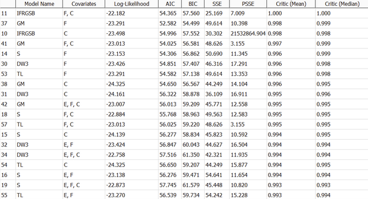
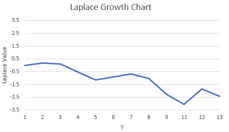
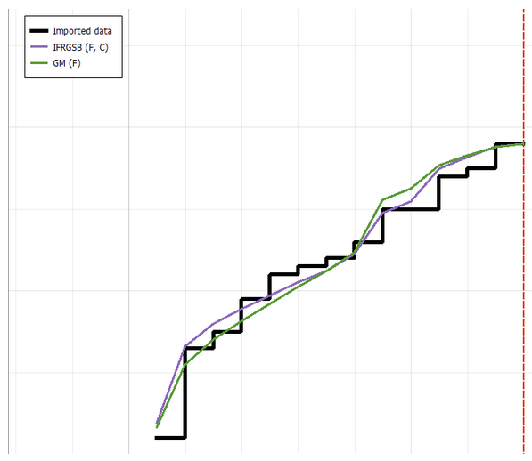
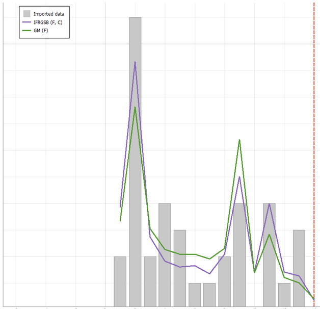
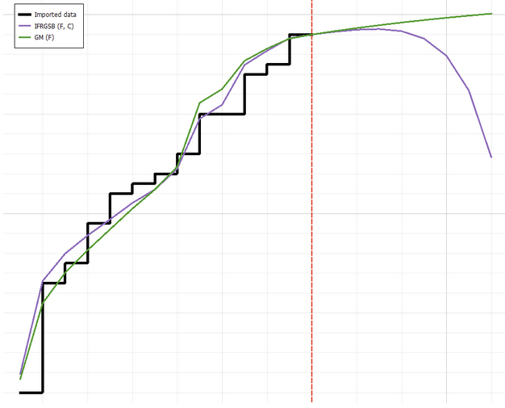
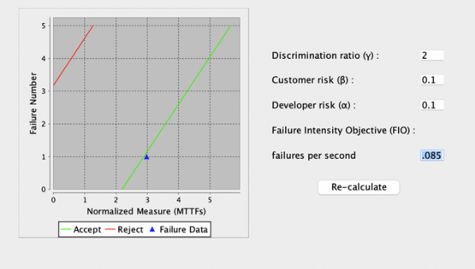
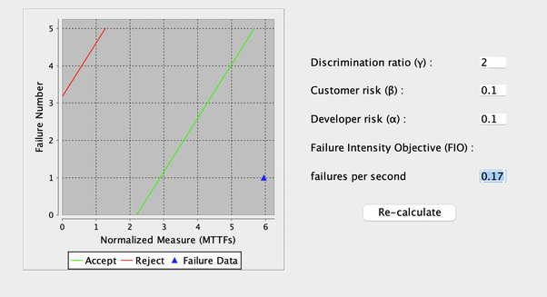
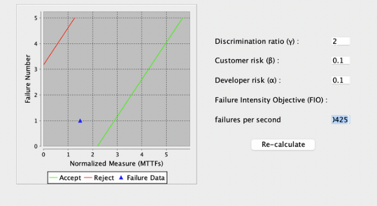

**SENG 438- Software Testing, Reliability, and Quality**

**Lab. Report \#5 – Software Reliability Assessment**

| Group \#5:      |     |
| -------------- | --- |
| Student Names: |     |
| Muhammad Tariq |     |
| Vrund Patel    |     |
| Anand Patel    |     |

# Introduction

# Assessment Using Reliability Growth Testing 

We selected the top 4 set of models that would provide the best fit for the project data using model ranking:
IFRGSB (F, C)
GM (F)
Critic values close to 1 indicates best overall models

We calculated each Laplace value for all our data rows. Graphing this data we saw that reliability increases and failure decreases from 3 until 11, after which it sharply decreases and becomes variable. Therefore from the data, we see that we should use the range 3 to 11 for testing.

Time-between-failures

Failure intensity

Reliability Graph

# A discussion on decision making given target failure rate

When we are making decisions regarding a target failure rate, we need to be careful with what is chosen because setting a target failure rate too high, or too low directly affects the cost of implementing and thus time of developers.

Setting a failure rate too low, may result in more time developers need to spend on making new tests and therefore increases costs for the team and alter profit margins.

Setting a failure rate too high, may result in less testing being done by developers. However, it may result in a lower reliability for the product and could lead to safety risks for the customers and therefore a failed product through bad customer reviews.

Overall, a target failure rate should be based on a thorough analysis of costs and reliability which can be achieved through reliability growth modeling to predict expected failure rate overtime as seen in this lab.

# A discussion on the advantages and disadvantages of reliability growth analysis

Advantages of the reliability growth model is that it allows us to measure improvements, achieve effectiveness and detect reliability problems early. Measuring improvements and detecting reliability problems early can be extremely beneficial for a product because it can help prevent real problems and decrease developers time to fix these problems. Achieving effectiveness is also highly valuable and is achieved with a reliability growth model because it gives us insight into things like target reliability, reliability growing/shrinking which can help developers maintain the software better and thus increasing effectiveness of the product.

Disadvantages of reliability growth analysis is that it can come with a lot of cost for the project and be very time consuming. It can cost the project because it requires people to spend time doing the analysis which results in a longer timeline for the project and increased costs. Since this analysis can require a large number of data we also need to collect this data and make ensure it has accurate failure data that is formatted properly in which it can be used by tools; this can become very time consuming for workers on a project, If there is inaccurate failure data this analysis can essentially become meaningless and result in making wrong decisions.

# Assessment Using Reliability Demonstration Chart 

MTFFmin Graph (0.085):

MTFFmin Twice Graph (0.17):

MTFFmin Half Graph (0.0425):

# Explain your evaluation and justification of how you decide the MTTFmin

We evaluated the system under various input parameters until the failure data was just barely beyond the acceptable threshold (the green line) in order to calculate the MTTF minimum, which happens to be 0.085 in our case.
Additionally, In order to comprehend the discrimination ratio, developer risk, and customer risk as well as their effects on the failure plot, we had also tested with what-if scenarios. In this instance, increasing the discrimination ratio to twice its initial value reduces the range where more testing is necessary by halving both acceptances and rejects. It is simpler to accept the value when we alter the customer risk since the acceptance value decreases. The rejection bar actually decreases when the developer risk doubles, making it simpler to reject data.

# A discussion on the advantages and disadvantages of RDC

One of the key benefits of employing RDC is that it provides a crystal-clear visual picture of the SUT's failure rate. When testing a system, this is crucial since it helps us determine whether the system is trustworthy enough to be deployed. RDC has a drawback in that, despite showing the number of system failures per unit of time, it does not explain how or why the system malfunctioned, which is crucial for troubleshooting the system.

# Comparison of Results with Part 1

Our reliability growth study and reliability demo chart both concluded that the SUT was dependable based on the provided failure data. Although there were occasional brief surges in intensity in part one, overall stability prevailed. The same was true for part 2, where the data would fluctuate between an acceptable and a "continue testing" status before also ultimately being entirely acceptable. This failure data set's overall trend indicates that the system is dependable.

# Discussion on Similarity and Differences of the Two Techniques

While evaluating an SUT during integration testing, reliability growth testing and reliability demonstration charts are also used. Inter failure time and either a goal failure rate or a minimum time to failure are used in both strategies. Data on failure counts is also used in reliability growth testing. The goal of reliability growth testing is to simulate past failure data and extrapolate that data into the future in order to determine how much additional testing and debugging the SUT needs before it is accepted. Three separate categories of risk are used by the reliability demonstration chart to evaluate the SUT. The primary risk component is the product or measurement risk. Customer risk and developer risk round out the other two. Customer risk is the likelihood that the SUT will be incorrectly rejected, whereas developer risk is the likelihood that the SUT will be incorrectly accepted. Using these risk levels and the failure data, the reliability demonstration chart is then created. This chart can be used to determine if the SUT can be approved or rejected or whether additional testing is necessary first.

# How the team work/effort was divided and managed

Since this lab was a little bit more complicated than expected, we decided to meet in person and do the lab together.

# Difficulties encountered, challenges overcome, and lessons learned

Using the SRTAT tool was one of the challenges we ran across because it wasn't functioning effectively. As the C-SFRAT tool did not include trend testing, one of the difficulties we overcame was trying to calculate the laplace trend test for the models in that tool. The reliability growth assessments tool may be used to examine a system's reliability growth and also assume a goal failure rate, which was one of the lessons we learned. We also learnt how to use the RDC to decide whether to reject, accept, or continue testing the product after MTTF has been fulfilled. We also learnt how to change given data sets to make them function with a tool from modeling the Reliability Demonstration Chart. The initial data set offered was in the form of a.CSV file. We had to modify the file format and data format in order to make the data usable with the SRTAT programme that was provided. Overall, we believe we are better prepared for the future if we encounter a file format that is incompatible with a modeling tool that has been made available.

# Comments/feedback on the lab itself

The lab was an excellent learning opportunity overall. We would have like more thorough explanations for the processes in parts 2.5.1 and 3.4.2, but we were able to figure it out in the end. We gained a lot of knowledge about reliability testing, reliability demonstration charts, and reliability assessment testing.